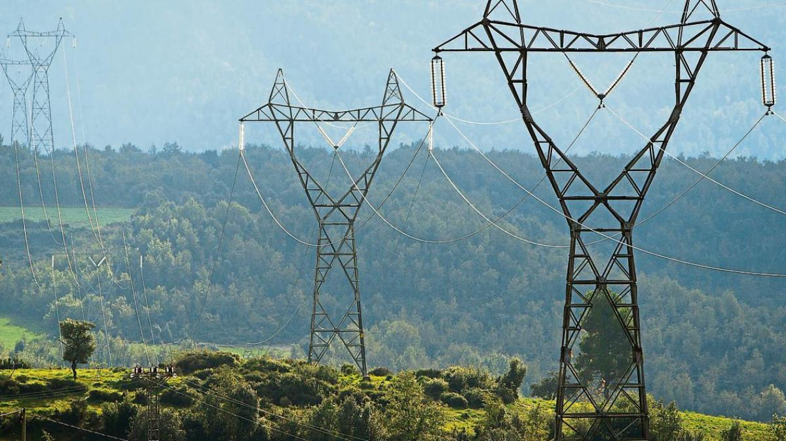
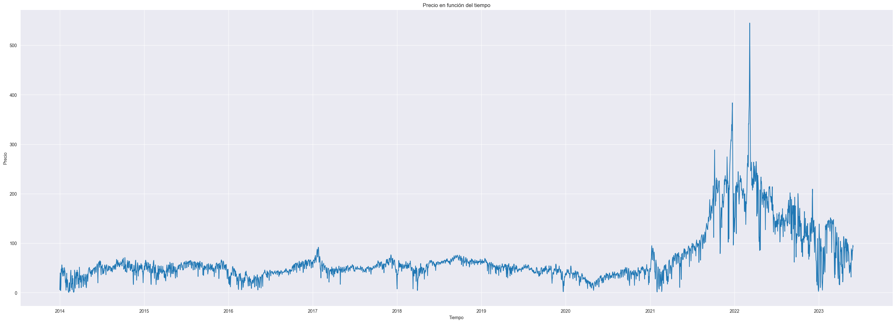
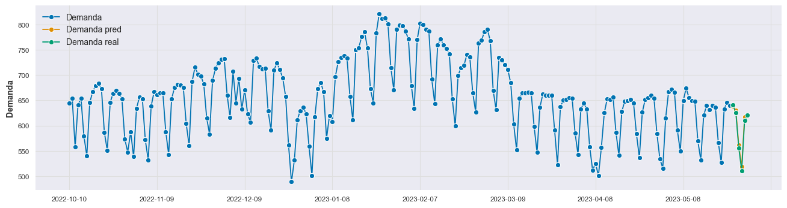
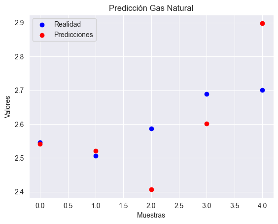
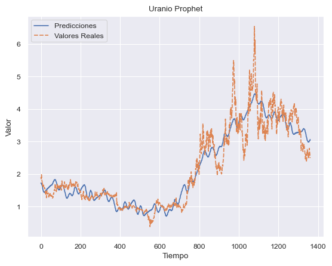
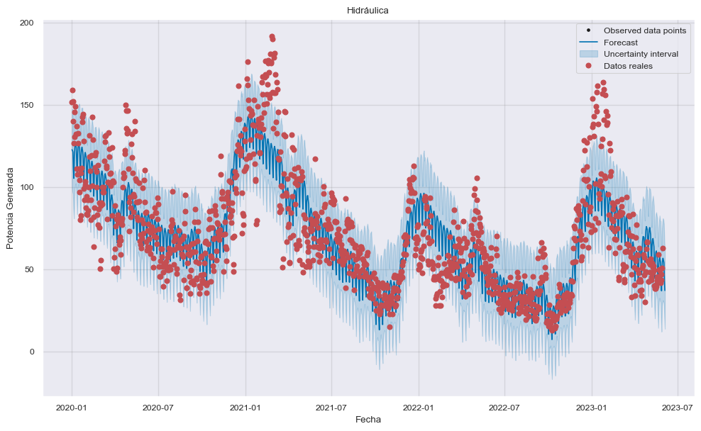
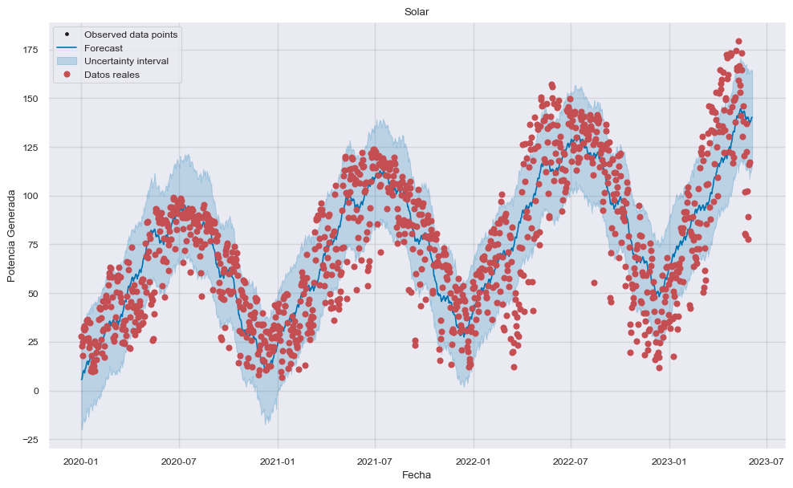

# Mercado eléctrico español
Predicción con Machine Learning del precio de la electricidad en España

# Introducción

En este proyecto, se exploran las variables que afectan el mercado eléctrico español y se emplean diversas técnicas de Machine Learning y aprendizaje no supervisado para realizar predicciones.

El motivo por el cual decidí embarcarme en este proyecto es por mi interés en comprender el mercado eléctrico y su funcionamiento. Considero que el conocimiento de las variables que influyen en el precio de la electricidad es de gran utilidad tanto para las empresas del sector como para los consumidores, ya que les permite tomar decisiones informadas y optimizar sus estrategias.

A lo largo de este proyecto, analizaremos datos históricos del mercado eléctrico español y exploraremos diferentes modelos de Machine Learning, como regresión lineal, redes neuronales y random forest, para encontrar el modelo que mejor se ajuste a los datos y nos brinde las predicciones más precisas.

Espero que este proyecto sea de utilidad tanto para las empresas del sector eléctrico como para los consumidores, y que nos permita comprender mejor el comportamiento del mercado eléctrico y anticiparnos a sus fluctuaciones de precio.

# Resumen

En el mercado eléctrico español, los agentes intercambian energía para cada hora del día siguiente. Las ofertas de compra y venta de energía se utilizan para construir las curvas de oferta y demanda, y el precio y volumen de la energía intercambiada dependen de la intersección entre estas curvas. Una vez que se realiza la casación de las curvas, se establecen los compromisos de entrega de energía y se determina el precio para cada franja horaria. La forma y valor de estas curvas están influenciados por varios factores, como la climatología que afecta la disponibilidad de energías renovables, el precio de los combustibles fósiles y los derechos de emisión de CO2. Por otro lado, la curva de compra está determinada principalmente por la demanda de electricidad de las comercializadoras y los grandes consumidores industriales.

Una vez que los datos están preparados, se plantea resolver el problema utilizando modelos de aprendizaje automático. Se mencionan algunos de estos modelos utilizados, como Prophet, ETS,  SARIMA, ARIMA, árboles de regresión y MLP Regressor. Estos modelos se emplean para predecir el precio de la electricidad y se utilizan como enfoques iniciales en el proyecto.

## Objetivo

El objetivo principal del trabajo es conocer el precio de la electricidad para el día siguiente. 

# Metodología

### Dataset

Para conocer el precio de la electricidad se van a realizar predicciones previas sobre:

- Potencia generada de las energías renovables,
- Demanda, 
- Precio de las emisiones de CO2 
- Precio del Gas Natural

Por lo tanto se han hecho modelos de Machine Learning para predecir cada una de estas variables y con el conjunto obtener el precio de la electricidad para el día siguiente. La justificación de este método es que la energía en España se compone principalmente de las renovables, la nuclear y del gas natural. Por lo tanto estas variables tienen una alta correlación con el precio de la electricidad.

Para llevar a cabo la predicción final del precio de la electricidad, se ha utilizado una red neuronal conocida como MLP Regressor. Esta red neuronal, que significa Multi-Layer Perceptron Regressor, es un tipo de modelo de aprendizaje automático que se utiliza para resolver problemas de regresión, como la predicción de valores numéricos.

### Evolución precio de la eléctricidad en España 

Predicción Demanda

El modelo que mejor se ajusta a la demanda es ETS ya que tiene un periodo estacional de 7 días

Predicción precio Gas Natural

Tas probar distintos modelos el que mejor se ajusta a la realidad es el XGB Boosting, se muestran los resultados para los próximos cinco días

rmse: 0.1258590053674676

Predicción precio Uranio

Predicción energías renovables

El modelo que mejor se ajusta a la energía hidraulica y solar es Prophet 

## Predicción final

Para llevar a cabo la predicción final del precio de la electricidad, se ha utilizado una red neuronal conocida como MLP Regressor. 

Utilizando todas estas variables, se ha entrenado y ajustado la MLP Regressor para que pueda aprender los patrones y relaciones entre las variables y el precio de la electricidad. Una vez que el modelo está entrenado, se emplea para realizar predicciones futuras del precio de la electricidad en función de los valores de las variables.

Este enfoque basado en redes neuronales permite obtener predicciones más precisas y adaptativas, ya que la MLP Regressor es capaz de capturar patrones complejos y no lineales en los datos. De esta manera, esperamos proporcionar una herramienta útil para predecir el precio de la electricidad y ayudar a las empresas y consumidores a tomar decisiones informadas en el mercado eléctrico.

### Fuentes de información

* Red Eléctrica de España (https://www.esios.ree.es/es)
    - Precio de la eléctricidad
    - Potencia generada
    - Demanda

* Plataforma de inversión con los históricos (https://www.investing.com/)

    - Gas Natural
    - Derechos de emisión del CO2
    - Indice Brent 

* Datos climatologicos 

    - AEMET